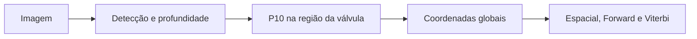

# DPVSA — Visão computacional e integração com HMM

Este repositório reúne a avaliação experimental da profundidade estimada para
válvulas e a integração dessa saída visual com um modelo oculto de Markov
(HMM). O objetivo é produzir observações espaciais que auxiliem a associação de
válvulas visualmente idênticas aos respectivos Gêmeos Digitais.

## Escopo do repositório

O projeto complementa duas implementações existentes, que continuam separadas:

- `api-digital-twin`: detecção das válvulas e estimação monocular de
  profundidade;
- `HMM_ASSET_DESAMBIGUATION`: associação espacial, Forward e Viterbi;
- `dpvsa-visual-hmm` (este repositório): análise das estimativas, validação do
  P10 e integração da saída visual salva com o HMM.



## Alternativa P10

Cada detecção delimita uma caixa orientada que pode conter diferentes partes da
válvula, espaços vazios e elementos do fundo. A alternativa avaliada considera
os valores válidos do mapa de profundidade dentro dessa caixa, ordena-os do
mais próximo ao mais distante e seleciona o percentil 10 (P10).

O P10 prioriza profundidades próximas sem utilizar diretamente o menor valor,
que seria mais sensível a um pixel isolado. Essa estratégia foi selecionada na
análise inicial das imagens `img1.jpeg` e `img5.jpeg`. Em seguida, suas
previsões foram congeladas antes do registro do gabarito da validação
independente.

## Validação independente

A validação utilizou seis medições das imagens `img2.jpeg`, `img3.jpeg` e
`img4.jpeg`.

| Estratégia | MAE | RMSE |
|---|---:|---:|
| Amostragem central da API | 0,5290 m | 0,7208 m |
| P10 na caixa orientada | 0,3265 m | 0,3784 m |

No conjunto avaliado, o P10 apresentou menor erro absoluto em quatro das seis
medições, com redução de 38,27% no MAE e de 47,51% no RMSE. As duas estratégias
ordenaram corretamente a válvula mais próxima nos três pares analisados; o P10
apresentou menor erro global na diferença de distância entre os pares.

Esses resultados constituem evidência inicial para este conjunto reduzido e
não demonstram superioridade universal da estratégia.

## O que é o script de integração

O arquivo [`scripts/integrar_hmm.py`](scripts/integrar_hmm.py) é um programa de
linha de comando escrito em Python. Ele não é uma nova API, não mantém uma
conexão de rede entre os projetos e não reúne os três repositórios em um só.

Durante uma execução, o script:

1. lê o CSV produzido pela etapa visual, com classe e coordenadas relativas à
   câmera;
2. lê poses da câmera, sequência temporal, cadastro global dos ativos,
   covariância e matriz de transição;
3. transforma cada ponto do sistema da câmera para o sistema global;
4. organiza as observações no formato exigido pelo HMM;
5. abre o notebook original do HMM pelo caminho informado;
6. extrai e executa somente as funções matemáticas de emissão, Forward e
   Viterbi;
7. grava as observações preparadas e as associações em arquivos CSV.

A transformação utilizada é:

$$
\mathbf{p}_{global}=\mathbf{R}(q)\mathbf{p}_{camera}+\mathbf{t},
$$

em que `R(q)` representa a orientação da câmera obtida do quaternion e `t`
representa sua posição global.

O contrato produzido para o HMM contém, entre outros campos:
`sequencia_id`, `t`, `x_observado`, `y_observado` e `z_observado`. A classe
detectada restringe os candidatos antes da associação probabilística.

## Demonstração rápida para a reunião

A demonstração abaixo utiliza os resultados já salvos e o notebook local do
HMM. Ela não precisa iniciar a API nem executar novamente os modelos de visão.

No diretório deste repositório, ative o ambiente virtual e informe a localização
do projeto do HMM:

```bash
source .venv/bin/activate

HMM_REPO="../HMM_ASSET_DESAMBIGUATION"
```

### 1. Mostrar a validação das distâncias

```bash
python scripts/avaliar_validacao_p10.py
```

Esse comando apresenta as seis comparações, o MAE, o RMSE e as reduções obtidas
com o P10.

### 2. Mostrar a ordenação relativa

```bash
python scripts/avaliar_ordenacao_relativa.py
```

Esse comando mostra se cada estratégia identificou corretamente qual válvula
estava mais próxima em cada imagem.

### 3. Mostrar a integração com o HMM

```bash
python scripts/integrar_hmm.py \
  --notebook-hmm "$HMM_REPO/notebooks/01_cenario_sintetico.ipynb" \
  --autoteste
```

Saída principal esperada:

```text
Autoteste concluído: transformação, adaptador e HMM compatíveis.
 t ativo_real predicao_espacial predicao_forward predicao_viterbi
 1          A                 A                A                A
 2          A                 A                A                A
 3          B                 B                B                B
```

O autoteste verifica uma sequência sintética conhecida (`A, A, B`), a
transformação geométrica e a chamada das funções originais do HMM. Ele comprova
a compatibilidade de software, não o desempenho do HMM com observações reais.

## Execução futura com dados reais

Os modelos dos arquivos necessários estão em
[`dados/integracao_hmm/`](dados/integracao_hmm/):

- `poses_camera_template.csv`;
- `sequencia_observacoes_template.csv`;
- `ativos_hmm_template.csv`;
- `covariancia_hmm_template.csv`;
- `transicoes_hmm_template.csv`.

Após o preenchimento desses dados, a execução seguirá esta forma:

```bash
python scripts/integrar_hmm.py \
  --notebook-hmm "$HMM_REPO/notebooks/01_cenario_sintetico.ipynb" \
  --previsoes dados/processados/previsoes_validacao_p10.csv \
  --poses dados/integracao_hmm/poses_camera.csv \
  --sequencia dados/integracao_hmm/sequencia_observacoes.csv \
  --ativos dados/integracao_hmm/ativos_hmm.csv \
  --transicoes dados/integracao_hmm/transicoes_hmm.csv \
  --covariancia dados/integracao_hmm/covariancia_hmm.csv \
  --saida-observacoes dados/processados/observacoes_hmm.csv \
  --saida-resultados resultados/integracao_hmm/associacoes_hmm.csv
```

## Estrutura principal

```text
dados/
├── integracao_hmm/          # modelos dos dados necessários ao HMM
├── medidas_reais/           # gabaritos das medições
├── processados/             # detecções e previsões derivadas
└── respostas_api/           # respostas salvas da API

resultados/
├── integracao_hmm/          # relatório da integração
└── validacao_independente/  # tabelas e relatório da validação P10

scripts/
├── avaliar_ordenacao_relativa.py
├── avaliar_validacao_p10.py
├── gerar_previsoes_validacao_p10.py
└── integrar_hmm.py
```

## Limitações atuais

A avaliação ponta a ponta com o HMM ainda requer:

- poses globais e sincronizadas da câmera;
- posições globais cadastradas das válvulas;
- sequências temporais com identidades de referência;
- matriz de transição da instalação real;
- covariância tridimensional estimada experimentalmente.

As medições disponíveis validam o erro escalar de distância e a ordenação
relativa. A integração completa com dados reais permanece como próxima etapa.

## Relatórios

- [Validação independente do P10](resultados/validacao_independente/relatorio_validacao_p10.md)
- [Integração estrutural com o HMM](resultados/integracao_hmm/relatorio_integracao_hmm.md)
